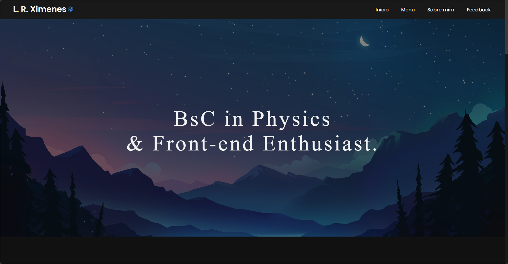

# Bem vind@ ao meu site pessoal

## Tecnologias utilizadas neste projeto

 
 
 

## Sobre o site

O projeto planeja ser publicado em um futuro próximo utilizando o , substituindo o meu site antigo que eu tentei fazer com base em um template já pronto, porém abandonei e decidi criar do zero por dois motivos: 
1. Aprender mais sobre Front-end, área a qual estou me interessando bastante;
2. Deixar o projeto com o design que eu desejo.

    

