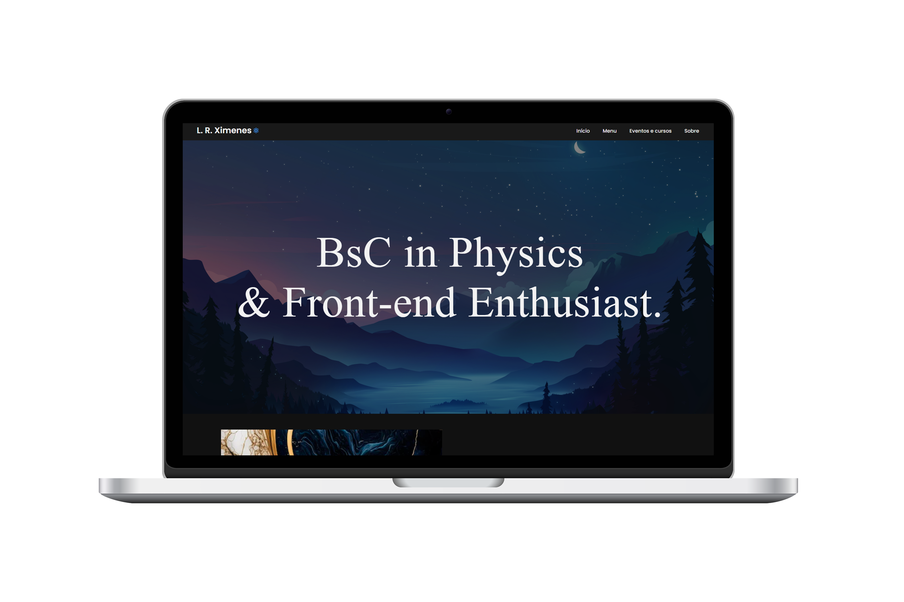

# Informações adicionais

##### Por L. R. Ximenes

Boas vindas ao `Readme.md` do meu site pessoal! Aqui irei descrever todas as informações que presumo que sejam úteis para um entendimento mais aprofundado sobre a construção do projeto como um todo, bem como informações adicionais que podem vir a ser interessantes.

## Tecnologias utilizadas

 
 
 

## Um breve resumo

O projeto planeja ser publicado em um futuro próximo utilizando o Github Pages, substituindo o meu site antigo que eu tentei fazer com base em um template já pronto, porém abandonei e decidi criar do zero por dois motivos: 

* Aprender mais sobre Front-end, área a qual estou me interessando bastante;
* Deixar o projeto com o design que eu desejo.

Como ainda estou aprendendo sobre as linguagens, existem muitas linhas de códigos que podem ser alteradas para melhor otimização, sendo assim, o site será atualizado constantemente, tanto para insersão de novas informações como para melhorias referentes à lógica de programação e em relação à organização, que é algo que eu prezo muito nos meus projetos.

## Organização do site
### Página Inicial
Nesta seção, cujo arquivo que o representa é o `index.html`, temos uma aba de apresentação geral do conteúdo, ou seja, algumas informações relevantes sobre mim e alguns projetos que estou fazendo ou já fiz e gostaria de dar o devido destaque. 

### Menu
Ao passar com o mouse em cima de menu, uma pequena caixa surge contendo algumas informações e foram divididas em

* **Projetos Atuais:** Ao clicar, abrirá uma nova página, representada pelo arquivo `Projetos-atuais.html` que possui um input para pesquisas e os projetos que estou desenvolvendo atualmente. 
    * Além do botão de Projetos atuais, coloquei alguns botões abaixo que redirecionam o usuário para as páginas dos respectivos projetos.

* **Arquivos Gerais:** Ao clicar, você será redirecionada para a página do arquivo `Arquivos-gerais.html`, onde também possuirá um input de pesquisas, porém com todos os arquivos que disponibilizei no site.
    * Além dos arquivos gerais, separei abaixo alguns conteúdos específicos em novas abas de pesquisa que são relevantes para o conteúdo geral do site.

* **Coisas que eu gosto:** Nesta seção mais descontraída, relacionada ao arquivo `Coisas-que-eu-gosto.html`, colocoquei apenas algumas informações sobre alguns conteúdos pelo qual me interesso e caso alguém queira, possa saber um pouco mais sobre mim.

### Eventos e cursos
Aqui vou colocar todos os eventos e cursos que já participei, sejam eles do meio acadêmico ou não. O arquivo correspondente à esta aba é `Eventos-e-cursos.html`.

### Sobre mim
Como o nome já diz, ao clicar neste botão, o usuário será redirecionado para a aba `Sobre-mim.html` onde coloqueialgumas informações pessoais e profissionais, além de todas as informações de contato que disponibilizarei.
